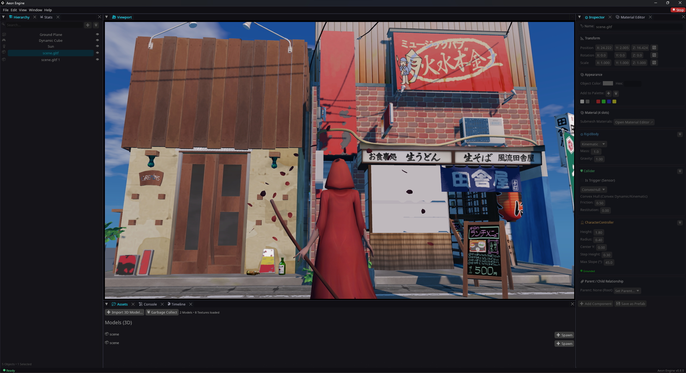

# Aeon Engine

[](https://opensource.org/licenses/MPL-2.0)
[](https://github.com/aethelisdev/aeon-engine)
[](https://www.rust-lang.org/)
[](https://youtube.com/@Aeonengine)
[](https://instagram.com/aeonengine)
[](https://x.com/aeonengine)

[English](../README.md) | [Türkçe](README_tr.md) | **日本語** | [简体中文](README_zh.md)



## Aeon Engine とは？
ほぼ完全に Safe Rust で書かれた、完全モジュール型のゲームエンジンです。

## 開発の背景
Rust の安全性とパフォーマンスに魅力を感じ、自身のゲーム開発のために軽量でモジュール性の高いエンジンを求めていました。既存のエンジンは要件に対して重量級すぎる一方、軽量なエンジンはビジュアル面で満足のいくものではありませんでした。そのため、高いグラフィック品質と軽量性を両立したエンジンを目指し、独自開発をスタートしました。

## Aeon Engine の目標
開発プロセスにおいて設定している主な目標は以下の通りです：

- **モジュール性（Modularity）**: 多くの依存関係に縛られることなく、エンジンのあらゆるサブシステムを容易に切り離し、または交換できる設計。
- **ユーザー環境に適応するシステム**: 初期状態ではゼロ負荷で起動し、レンダリング、物理演算、オーディオなどのモジュールはユーザーの必要に応じて動的に有効化・無効化されます。また、低スペック環境向けに、長期的にはこれらのリソースを RAM から解放できるクリーンアップ機能の導入も検討しています。
- **Rust コードとビジュアルプログラミングの統合（RedWrite）**: RedWrite は、Rust コードとビジュアルプログラミングをリアルタイムに同期させる機能です。どちらか一方で行われた変更が、もう一方へ双方向かつ即座に反映されることを目指しています。
- **Android デバイス上でのエディタ動作**: 高いモジュール性と優れたパフォーマンスを確立した暁には、Android デバイス上で直接ゲーム制作が可能なエディタとして展開し、「Android 上での本格的なゲーム開発は不可能」という先入観を打破することを目指しています。

## 開発状況
Aeon Engine は現在アクティブに開発中です。

コアシステムの大部分はすでに実装されていますが、API や各種機能は今後変更される可能性があります。

## 実行方法
システムに Rust がインストールされていることを確認してください。

```bash
git clone https://github.com/aethelisdev/aeon-engine.git
cd aeon-engine

# Aeon Hub（プロジェクトマネージャー兼ランチャー）を起動
cargo run --release

# またはエディタを直接起動:
cargo run -p ae_engine --release
```

## 設計思想

- **モジュール設計**
- **シンプルなエディタ**
- **ハイパフォーマンス**
- **Safe Rust**
- **過度な複雑さの排除**
- **オープンソース**

## ライセンス

Aeon Engine のソースコードは **Mozilla Public License 2.0 (MPL 2.0)** の下で公開されています。

- **インディー開発者およびクリエイター向け**: Aeon Engine を使用して商用のプロプライエタリ（ソースコード非公開）ゲームを制作・販売することができます。ゲームロジックやソースコードを公開する義務はありません。
- **エンジンの改変**: コアエンジンのファイル を変更した場合は、その変更分を MPL 2.0 に基づいて公開する必要があります。
- **商用およびエンタープライズライセンス**: 個別の商用ライセンス、プロプライエタリなエンジンフォーク、または企業向けサポートオプションについては、AethelisDEV までお問い合わせください。